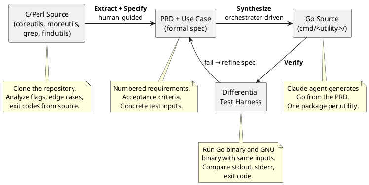

# go-unix-utils

Go implementations of 123 Unix utilities (coreutils, moreutils, grep, findutils), generated from formal specifications and verified against GNU reference binaries.

## Why

Man pages are ambiguous. Unit tests with hardcoded expectations encode a human's interpretation of behavior, not the behavior itself. This project takes a different approach: derive specifications directly from the C source code, then verify the Go implementation by running it side-by-side with the GNU binary and comparing outputs byte-for-byte. The specification and verification are the product; the Go binaries are a byproduct.

This is spec-driven development applied to systems programming. The human writes the spec. An AI orchestrator generates the code. A differential testing harness decides whether the code is correct.

## Pipeline



## Status

The project is in the specification phase. No Go implementations exist yet; the current focus is building a complete, verified specification suite before code generation begins.

| Metric | Count |
| ------ | ----: |
| Target utilities | 123 |
| PRDs written (utility) | 7 (ts, wc, cat, sponge, ls core, ls extended, du) |
| PRDs written (shared components) | 3 (pkg/testutils, pkg/sys, pkg/format) |
| Use cases written | 7 |
| Test suites written | 7 |
| Go implementations | 0 |

Roadmap: [docs/road-map.yaml](docs/road-map.yaml). Full utility catalog with difficulty ratings, memory models, and implementation profiles: [docs/utilities.yaml](docs/utilities.yaml).

## Methodology

**Extract.** Clone the C or Perl source repository (GNU coreutils, moreutils, grep, findutils). Read the source — not the man page — to catalog every flag, exit code, signal handler, and edge case. The source is the specification authority.

**Specify.** Write a PRD with numbered requirements, acceptance criteria, and design decisions for each utility. Write a use case describing a concrete end-to-end execution path. Write a test suite with explicit inputs and expected structural outputs. Shared components (syscall abstractions, output formatting, the test harness itself) get their own PRDs when their requirements span multiple utilities.

**Synthesize.** A Claude-based orchestrator reads the PRD and generates Go source. The human does not write Go; the orchestrator does not write specs. This separation isolates specification quality from generation quality, making each independently measurable.

**Verify.** A differential testing harness executes both the Go binary and the Homebrew GNU reference binary (e.g., `gls`, `gdu`, `gcat`) with identical arguments, environment, and stdin. It compares stdout, stderr, and exit code. Normalization hooks handle acceptable differences (e.g., mtime fields in `ls -l` output). If the outputs diverge, the harness reports the triggering input, both raw outputs, and both exit codes.

## Repository Structure

```text
go-unix-utils/
├── docs/
│   ├── VISION.yaml                  Project goals, risks, boundaries
│   ├── ARCHITECTURE.yaml            Components, design decisions, tech choices
│   ├── utilities.yaml               Full 123-utility catalog
│   ├── road-map.yaml                Release schedule and use case status
│   ├── specs/
│   │   ├── product-requirements/    Per-utility and shared component PRDs
│   │   ├── use-cases/               Concrete end-to-end execution paths
│   │   └── test-suites/             Explicit inputs and expected outputs
│   └── engineering/                 Engineering guidelines
├── cmd/                             One package per utility (grows with roadmap)
├── pkg/
│   ├── sys/                         Darwin/Linux syscall abstractions
│   ├── format/                      Table alignment, colors, human-readable sizes
│   └── testutils/                   Differential testing harness
└── magefiles/                       Build targets (build, lint, test, analyze)
```

## Technology Choices

**Go** for the implementations. Go's constrained type system and lack of implicit behavior make it predictable input for AI code generation. A Claude agent producing Go is less likely to introduce subtle bugs than one producing C++ or Rust, because there are fewer ways to express the same logic.

**Differential testing against Homebrew GNU binaries** rather than unit tests with expected constants. Both binaries stat the same files on the same filesystem, so block counts, inode numbers, and file sizes are deterministic. The test is "does the Go binary produce the same output as the GNU binary?" not "does the Go binary produce the output I think is correct?"

**`golang.org/x/sys` as the only external dependency.** Platform-divergent syscall field names (`st_mtimespec` on Darwin vs. `st_mtim` on Linux), ioctl constants, and signal mask operations require it. Everything else is standard library. `golang.org/x/text/collate` is the planned addition when locale-sensitive utilities are scheduled.

**PlantUML for architecture diagrams.** Defined inline in documentation, not as separate files.

## Build and Test

```bash
# Build all utilities to bin/
mage build

# Run all tests (including differential tests)
go test ./...

# Lint
mage lint

# Cross-artifact consistency checks (PRDs, use cases, test suites, roadmap)
mage analyze

# Print lines of code and documentation word counts
mage stats
```

Requires Go 1.21+, [Mage](https://magefile.org/), and Homebrew GNU coreutils/moreutils (`brew install coreutils moreutils`).

## Documentation

- [VISION.yaml](docs/VISION.yaml) -- Project goals, success criteria, risks, and boundaries
- [ARCHITECTURE.yaml](docs/ARCHITECTURE.yaml) -- Component descriptions, design decisions, technology choices
- [Engineering guidelines](docs/engineering/) -- Conventions and practices above the code
