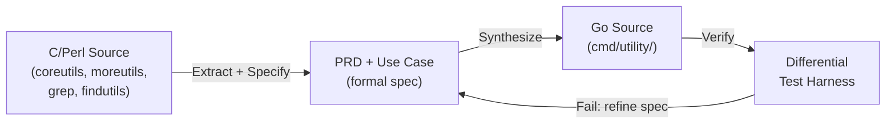

# go-unix-utils

Go implementations of 123 Unix utilities (coreutils, moreutils, grep, findutils), generated from formal specifications and verified against GNU reference binaries.

## Architectural Thesis

Man pages are ambiguous. Unit tests with hardcoded expectations encode a human's interpretation of behavior, not the behavior itself. We take a different approach: derive specifications directly from the C source code, then verify the Go implementation by running it side-by-side with the GNU binary and comparing outputs byte-for-byte. The specification and the verification are the product; the Go binaries are a byproduct.

We apply spec-driven development to systems programming. The human writes the spec. An AI orchestrator generates the code. A differential testing harness decides whether the code is correct.

## Pipeline



## Scope and Status

We have completed specifications for the first three releases. The first generation run produced 4,586 lines of Go across 22 files in 16 measure+stitch cycles; that code is available at the generation-merged tags (see Tagging Scheme). The working branch contains specifications only.

| Metric | Count |
| ------ | ----: |
| Target utilities | 123 |
| PRDs written (utility) | 7 (ts, wc, cat, sponge, ls core, ls extended, du) |
| PRDs written (shared components) | 3 (pkg/testutils, pkg/sys, pkg/format) |
| Use cases written | 7 |
| Test suites written | 4 (one per release: rel01.0, rel01.1, rel02.0, rel02.1) |
| Go implementations | at generation-merged tags (2,842 production + 1,744 test LOC) |

Roadmap: [docs/road-map.yaml](docs/road-map.yaml). Full utility catalog with difficulty ratings, memory models, and implementation profiles: [docs/utilities.yaml](docs/utilities.yaml).

## Tagging Scheme

The repository uses a two-prefix versioning convention to distinguish human-written specifications from Claude-generated code.

`v0.YYYYMMDD.N` tags mark specification-only releases. The repository at a v0 tag contains PRDs, use cases, test suites, architecture documents, and build infrastructure -- everything a human wrote. No Go implementation code is present. These tags represent the input to the generation pipeline.

`v1.YYYYMMDD.N` tags mark generation releases. The repository at a v1 tag contains everything from the corresponding v0 baseline plus the Go source code that the cobbler pipeline produced. Each v1 tag is the output of a complete generation run: one or more measure+stitch cycles that read the specifications and wrote the implementations.

The intended lifecycle: a human writes specifications and tags v0, the pipeline generates code and tags v1, then the generated code is removed from the working branch so that the next specification edit starts from a clean v0 state. This separation makes it possible to re-generate all code from any v0 tag, compare v1 tags across generation runs, and measure specification quality independently of generation quality.

The first generation run is documented in [eng04](docs/engineering/eng04-generation-run-results.yaml). Generated code lives at v1 tags; the working branch carries specifications only.

## Methodology

Extract. We clone the C or Perl source repository (GNU coreutils, moreutils, grep, findutils) and read the source -- not the man page -- to catalog every flag, exit code, signal handler, and edge case. The source is the specification authority.

Specify. We write a product requirements document (PRD) with numbered requirements, acceptance criteria, and design decisions for each utility. We write a use case describing a concrete end-to-end execution path. We write a test suite with explicit inputs and expected structural outputs. Shared components (syscall abstractions, output formatting, the test harness itself) get their own PRDs when their requirements span multiple utilities.

Synthesize. A Claude-based orchestrator reads the PRD and generates Go source. The human does not write Go; the orchestrator does not write specs. This separation isolates specification quality from generation quality, making each independently measurable.

Verify. A differential testing harness executes both the Go binary and the Homebrew GNU reference binary (e.g., `gls`, `gdu`, `gcat`) with identical arguments, environment, and stdin. It compares stdout, stderr, and exit code. Normalization hooks handle acceptable differences (e.g., mtime fields in `ls -l` output). If the outputs diverge, the harness reports the triggering input, both raw outputs, and both exit codes.

## Repository Structure

```text
go-unix-utils/                         Specification-only working branch
├── docs/
│   ├── VISION.yaml                  Project goals, risks, boundaries
│   ├── ARCHITECTURE.yaml            Components, design decisions, tech choices
│   ├── SPECIFICATIONS.yaml          PRD, use case, and test suite index
│   ├── utilities.yaml               Full 123-utility catalog
│   ├── road-map.yaml                Release schedule and use case status
│   ├── specs/
│   │   ├── product-requirements/    Per-utility and shared component PRDs
│   │   ├── use-cases/               Concrete end-to-end execution paths
│   │   └── test-suites/             Explicit inputs and expected outputs
│   └── engineering/                 Engineering guidelines
└── magefiles/                       Build targets (build, lint, test, analyze)

At v1 tags only:
├── cmd/                             One package per utility
└── pkg/                             Shared libraries (sys, format, testutils)
```

## Technology Choices

Go for the implementations. Go's constrained type system and lack of implicit behavior make it predictable input for AI code generation. A Claude agent producing Go introduces fewer subtle bugs than one producing C++ or Rust, because there are fewer ways to express the same logic.

Differential testing against Homebrew GNU binaries rather than unit tests with expected constants. Both binaries stat the same files on the same filesystem, so block counts, inode numbers, and file sizes are deterministic. The test is "does the Go binary produce the same output as the GNU binary?" not "does the Go binary produce the output I think is correct?"

`golang.org/x/sys` as the only external dependency. Platform-divergent syscall field names (`st_mtimespec` on Darwin vs. `st_mtim` on Linux), ioctl constants, and signal mask operations require it. Everything else is standard library. `golang.org/x/text/collate` is the planned addition when locale-sensitive utilities are scheduled.

## Build and Test

```bash
# Build all utilities to bin/
mage build

# Run all tests (including differential tests)
go test ./...

# Lint
mage lint

# Cross-artifact consistency checks (PRDs, use cases, test suites, roadmap)
mage analyze

# Print lines of code and documentation word counts
mage stats
```

Requires Go 1.21+, [Mage](https://magefile.org/), and Homebrew GNU coreutils/moreutils (`brew install coreutils moreutils`).

## Documentation

- [VISION.yaml](docs/VISION.yaml) -- Project goals, success criteria, risks, and boundaries
- [ARCHITECTURE.yaml](docs/ARCHITECTURE.yaml) -- Component descriptions, design decisions, technology choices
- [SPECIFICATIONS.yaml](docs/SPECIFICATIONS.yaml) -- PRD, use case, and test suite index with traceability
- [Engineering guidelines](docs/engineering/) -- Conventions and practices above the code
