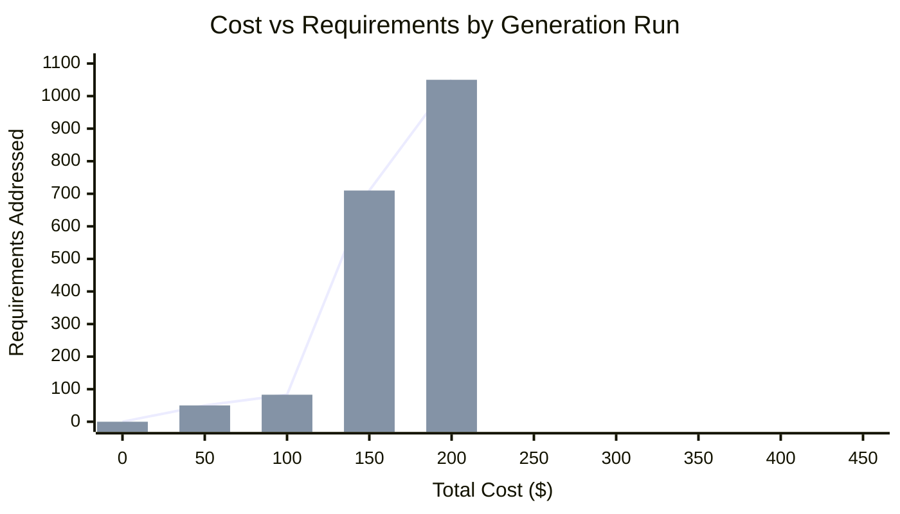

# Generation Run 37

Date: 2026-03-19 to 2026-03-21
Issue: GH-2626
Branch: generation-gh-2626-run37
Scaffold: v0.20260317.2

## Summary

Run 37 is the largest and most efficient generation to date. 301 stitch tasks, 52,030 LOC, $433 across 3 days. Reached 97% of all requirements (1,050/1,081). The run generated 73 PRDs covering releases 00.0 through 08.1. Three items were deferred to rel99.0: prd004-ts R6 (complexity timeout), prd070-fmt R3 (complexity timeout), and prd072-od (rate limit exhaustion).

## Stats

| Metric | Value |
|--------|-------|
| Tasks | 301 done |
| LOC prod | +25,923 |
| LOC test | +26,107 |
| Total LOC | +52,030 |
| Cost | $432.73 (stitch $366.08 + measure $66.65) |
| Turns | 5,934 |
| Tokens | 255.6M in, 5.2M out |
| Requirements | 1,050/1,081 (97%) |
| PRDs completed | 72 of 73 (prd072-od partial) |
| Releases | rel00.0 through rel08.1 |
| Cost/requirement | $0.41 |
| Cost/task | $1.44 |
| Measure overhead | 15.4% of total cost |

## Cross-Run Comparison

| Run | Date | Tasks | LOC | Cost | Requirements | Cost/Req | Measure % |
|-----|------|-------|-----|------|-------------|----------|-----------|
| 26 | 2026-03-09 | 18 | 3,437 | $20 | ~50 | $0.40 | 50% |
| 27 | 2026-03-09 | 22 | 2,316 | $21 | 50 | $0.42 | ~50% |
| 31 | 2026-03-12 | 241 | 44,620 | $139 | ~400 | $0.35 | 61% |
| 32 | 2026-03-14 | 13 | 1,918 | $12 | 42 | $0.29 | 36% |
| 33 | 2026-03-14 | 24 | 3,965 | $33 | 83 | $0.40 | 41% |
| 34 | 2026-03-15 | 246 | 37,542 | $429 | 710 | $0.60 | 26% |
| 35 | 2026-03-17 | 5 | 557 | ~$5 | ~20 | ~$0.25 | — |
| 36 | 2026-03-17 | 13 | ~2,000 | ~$2 | ~50 | ~$0.04 | — |
| **37** | **2026-03-19** | **301** | **52,030** | **$433** | **1,050** | **$0.41** | **15%** |

Run 37 addresses 48% more requirements than run 34 at roughly the same total cost. The cost per requirement ($0.41) returned to the efficient range seen in runs 26-33 after the regression in run 34 ($0.60). The measure overhead dropped from 26% (run 34) to 15%, confirming the multi-issue measure optimization from runs 35-36.

## Efficiency Gains Over Run 34

Run 34 was the previous full-scale run. Run 37 improved on it in every dimension:

| Metric | Run 34 | Run 37 | Change |
|--------|--------|--------|--------|
| Requirements | 710 (65%) | 1,050 (97%) | +48% |
| LOC | 37,542 | 52,030 | +39% |
| Cost | $429 | $433 | +1% |
| Cost/req | $0.60 | $0.41 | -32% |
| Measure cost | $112 (26%) | $67 (15%) | -40% |
| Tasks | 246 | 301 | +22% |

The cost reduction comes from two sources. Multi-issue measure (max_measure_issues=3, introduced in run 36) proposes 3 tasks per cycle instead of 1, amortizing the fixed prompt cost. The stitch_exclude_tests context optimization (introduced in run 28) keeps stitch prompts at 85-170KB instead of scaling with accumulated test LOC.

## Findings

### Stitch timeout on complex requirement groups

Three PRD requirement groups exceeded the 15-minute stitch timeout: prd004-ts R6 (multi-format date parser), prd070-fmt R3 (formatting options), and prd072-od R1 (rate-limited). The first two are genuinely complex — each requirement involves dense implementation work (parsing, formatting algorithms). The orchestrator treats all timeouts identically and halts after 3 consecutive zero-LOC cycles.

Mitigation applied: removed the stuck requirements from PRD files and deferred to rel99.0. This was the only effective approach — marking releases as code_complete in the road-map and removing releases from configuration.yaml did not prevent the measure agent from re-proposing tasks (cobbler-scaffold#1703).

### Measure agent ignores release status signals

The measure agent reads PRD files directly and proposes tasks for any unimplemented requirements, regardless of the road-map release status (code_complete) or the configuration.yaml releases list. This is a bug: both signals should suppress task proposal. Five attempts to skip prd004-ts R6 via configuration were needed before discovering that only PRD modification works.

### Rate limits dominate late-run task failures

In the final 30% of the run, rate limit pauses consumed most of the 15-minute task timeout. A task needing 3 minutes of Claude processing would hit a 13-minute rate limit pause and get killed at 15 minutes. The orchestrator counts this as a task failure identical to a genuine complexity timeout. The fix requires tracking rate limit wait time separately from active processing time (cobbler-scaffold#1805).

### Machine suspend recovery

The generation survived two machine suspends (overnight reboot, manual suspend). Recovery required cleaning up stale worktree state: resetting in-progress issue labels to ready, removing orphaned worktrees, and deleting stale task branches. This is the same manual procedure as run 34, now well-understood.

## Items Deferred to rel99.0

| PRD | Requirements | Reason | Follow-up |
|-----|-------------|--------|-----------|
| prd004-ts | R6.1-R6.5 | Multi-format date parser exceeds stitch time budget | GH-2938 |
| prd070-fmt | R3.1-R3.4 | Formatting options (-s, -u, -p, -t) exceed stitch time budget | GH-3108 |
| prd072-od | R1.1-R1.4+ | Rate-limited out of every attempt | — |

## Issues Filed

### go-unix-utils
- GH-2938: prd004-ts R6 stitch tasks time out at 15 minutes
- GH-3108: prd070-fmt R3: implement deferred formatting options

### cobbler-scaffold
- cobbler-scaffold#1699: Auto-skip stitch tasks after repeated timeouts instead of halting generation
- cobbler-scaffold#1703: Measure agent ignores road-map code_complete status and configuration releases list (bug)
- cobbler-scaffold#1708: ETA calculation uses wall-clock time instead of Claude API execution time
- cobbler-scaffold#1805: Orchestrator should handle rate limits separately from task failures
- cobbler-scaffold#1832: Support requirement weights in PRDs for stitch task sizing
